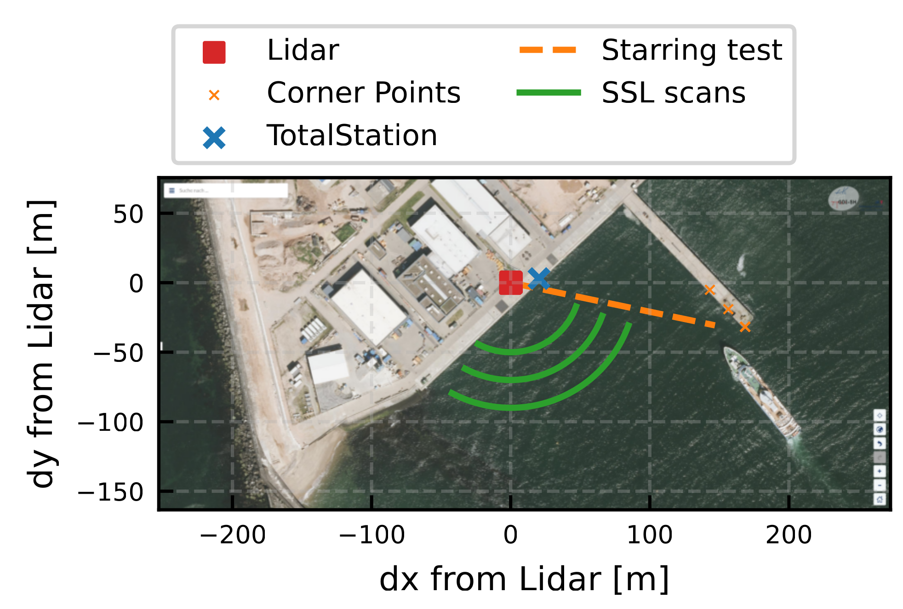

.. lidalign documentation master file, created by
   sphinx-quickstart on Thu Feb 19 14:41:43 2026.
   You can adapt this file completely to your liking, but it should at least
   contain the root `toctree` directive.

Validation Campaign at Heligoland
=================================

   Setup of the validation campaign.

Here you can find some notebooks that were created for the manuscript: 

    Paul Julian Meyer, Andreas Rott, Jörge Schneemann, Lukas Pauscher, Kira Gramitzky, Martin Kühn: Experimental validation of the Sea Surface Calibration for scanning lidar static elevation offset determination, Torque 2026 (in preparation)

The data, that is required to reproduce the results of the manuscript, is available in the associated dataset:

    Meyer, P. J., Rott, A., & Schneemann, J. (2026). Scanning Wind lidar measurement data as supplement to "Experimental validation of the Sea Surface Calibration for scanning lidar static elevation offset determination" (1.0) [Data set]. Zenodo. https://doi.org/10.5281/zenodo.18698332

The notebooks are available in the `applications` folder of the repository.

.. toctree::
    :maxdepth: 2
    :titlesonly:
    :caption: Links to the notebooks:
    
    Test Setup Heligoland <notebooks/_temp/00_TestSetup_Heligoland>
    Starring Test <notebooks/_temp/01_StarringTests_Heligoland>
    Corner Scan Test <notebooks/_temp/20_CornerScanTest_Heligoland>
    SSC Scan Test <notebooks/_temp/30_SSC_Scan_Evaluation>
    SSC Numerical Sensitivity <notebooks/_temp/98_SSC_sensitivity_numerical>
    SSC Importance of accurate elevation <notebooks/_temp/99_Importance_of_accurate_elevation>

   
   
   
