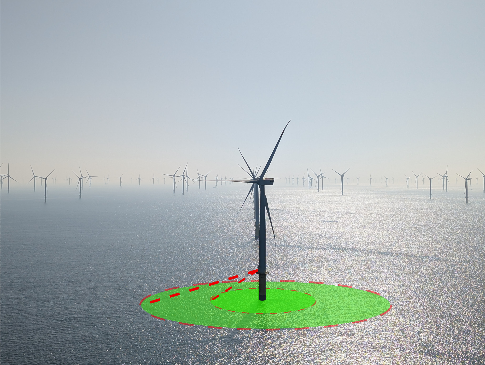

lidalign python package
=======================

Welcome to the lidalign documentation! This package provides tools for aligning scanning lidar in offshore applications and calibrate scanner head offsets!

   Visualisation of a scanning lidar at an offshore test site. (Photo: Paul Meyer)

You will find some usage examples, the analysis of the validation campaign performed at Heligoland and the API Documentation of the package. 
If you would like to contribute, please use the Github repository to create issues and requests. The repository will live by contributions and feedback from the community!

.. toctree::
   :maxdepth: 1
   :caption: Application examples:

   notebooks/Example_HTM_Elevation
   notebooks/Example_SSC
   notebooks/Example_Azimuth_NorthAlignment

.. toctree::
   :maxdepth: 2
   :caption: SSC validation campaign at Heligoland [Meyer et al. 2026]

   ValidationCampaign

.. toctree::
   :maxdepth: 2
   :caption: Package API:

   api/lidalign

   

References
----------
If the scripts are used, please cite the following:

    Paul Julian Meyer, Andreas Rott, Janna K. Seifert, Jörge Schneemann: Software, *lidalign* python package V2.0, 2026

The associated dataset for the publication can be found here:

    Meyer, P. J., Rott, A., & Schneemann, J. (2026). Scanning Wind lidar measurement data as supplement to "Experimental validation of the Sea Surface Calibration for scanning lidar static elevation offset determination" (1.0) [Data set]. Zenodo. https://doi.org/10.5281/zenodo.18698332

For the general work, please cite:

    Paul Julian Meyer, Andreas Rott, Jörge Schneemann, Lukas Pauscher, Kira Gramitzky, Martin Kühn: Experimental validation of the Sea Surface Calibration for scanning lidar static elevation offset determination, Torque 2026 (in preparation)

and 

    Rott, A., Schneemann, J., Theuer, F., Trujillo Quintero, J. J., and Kühn, M.: Alignment of scanning lidars in offshore wind farms, Wind Energ. Sci., 7, 283–297, https://doi.org/10.5194/wes-7-283-2022, 2022. 

Preliminary Work by Rott et al. 2022
------------------------------------

The *lidalign* package is heavily based on the work by Rott et al. 2022:

    Rott, A., Schneemann, J., Theuer, F., Trujillo Quintero, J. J., and Kühn, M.: Alignment of scanning lidars in offshore wind farms, Wind Energ. Sci., 7, 283–297, https://doi.org/10.5194/wes-7-283-2022, 2022.
   
    Andreas Rott, Jörge Schneemann, & Frauke Theuer. (2021). AndreasRott/Alignment_of_scanning_lidars_in_offshore_wind_farms: Version1.0 (Release1.0.0). Zenodo. https://doi.org/10.5281/zenodo.5654919
    

The deprecated code of Rott et al. 2022 is available in the `LegacyRott` folder of the repository and can be seen here:

.. toctree::
   :maxdepth: 1
   :caption: Legacy code of Rott et al. 2022:

   notebooks/LegacyRott/Hard_Targeting
   notebooks/LegacyRott/Sea_Surface_Leveling

Acknowledgements
----------------

The *lidalign* development was funded by the German Research Foundation (DFG) – project ID 434502799 – SFB 1463 and the German Ministry for Economic Affairs and Energy on the basis of a decision by the German Bundestag (WindRamp II, grant no. 03EE3101A). 
